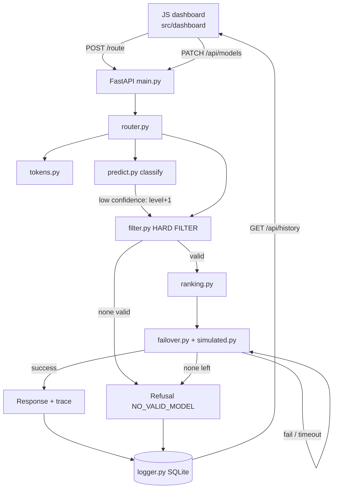

# Architecture

```mermaid
flowchart TD
    UI[JS dashboard<br/>src/dashboard] -->|POST /route| API[FastAPI main.py]
    UI -->|PATCH /api/models| API
    API --> R[router.py]
    R --> T[tokens.py]
    R --> C[predict.py classify]
    C -->|low confidence: level+1| F
    R --> F[filter.py HARD FILTER]
    F -->|none valid| X[Refusal NO_VALID_MODEL]
    F -->|valid| K[ranking.py]
    K --> V[failover.py + simulated.py]
    V -->|fail / timeout| V
    V -->|success| O[Response + trace]
    V -->|none left| X
    O --> L[(logger.py SQLite)]
    X --> L
    L -->|GET /api/history| UI
```
Rule: only `filter.py` decides who is allowed. `failover.py` never sees a rejected model.
